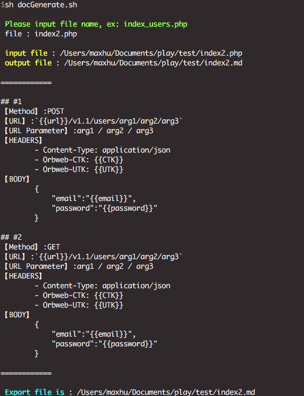

# readme

## 目的

將註解的內容，依照格式完整地變成一份檔案
目前預設的
 
- start_sign : `/*===`
- end_sign : `===*/`

介於此註解中的內容，會完整的產生到 .md 中

如範例 index2.php -> index2.md

## 注意

- 輸入的檔案，為相對位置
- 輸出的檔案，為本地位置
- 預設的 `start_sign` & `end_sign`，長度為固定的 5
	- 配合他種語言，請選擇適當的 sign

## 使用

