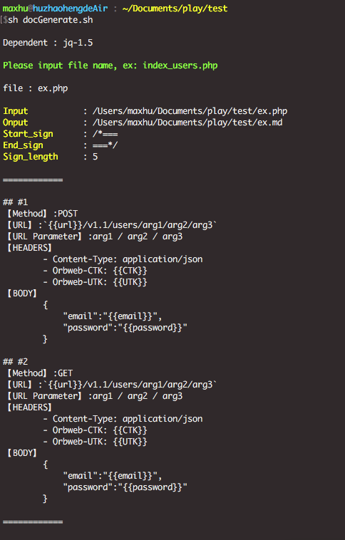

# readme

## 目的

不論是寫何種語言，都希望能把當下程式中的註解，直接轉譯為 .md，並且能最小化註解風格格式化 
方便性為，若為 restful-api 對外的文件，則可直接將要公開的文件內容輸出為 .md 檔案 
降低文件的重複編輯性，加速工程人員對於文件註解的習慣與完整性

Hope this script could help accelerate development and persist in good comment habit.
Do not need to maintain twice version between code and document.
When developer write down comment in code context, it mean that you finish the document at the same time. 

## config.json

- 每個 tag 都有預設值
- 參數說明
	- "Default_info" : 說明預設值
	- input.path : ( default is `./` )
	- output.path : ( default is `./` )
	- output.name : ( default is `input.name` )
	- output.ext : ( default is `.md` )
	- sign.start : ( default is `/*===` )
	- sign.end : ( default is `===*/` )
	- sign.length : ( default is `5` )
- 如範例 ex.php -> ex.md

## 使用




## Notice : output format Troubleshoot

- **若註解中該行無內容且為換行的位置，為保持可讀性 : 請於要換行的位置，增加一個 space**
- **當輸出的檔案中，需要有換行的位置(但該行無內容)，請增加一個 space，保持編譯時的可讀性**
- **when output file need text wraps automatically, please add a 'space' in the line**
- ex : 注意 第4行 請增加一個 space，保持程式換行的可讀性，可參考 ex.php

	```
	/*===
	comment
	comment
	
	comment
	===*/
	```
